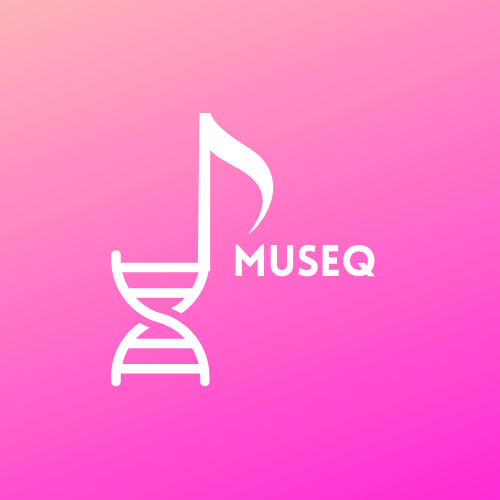

<!-- Improved compatibility of back to top link: See: https://github.com/othneildrew/Best-README-Template/pull/73 -->

<!-- PROJECT SHIELDS -->
[![Contributors][contributors-shield]][contributors-url]
[![Forks][forks-shield]][forks-url]
[![Stargazers][stars-shield]][stars-url]
[![Issues][issues-shield]][issues-url]
[![Unlicense License][license-shield]][license-url]
[![LinkedIn][linkedin-shield]][linkedin-url]

<!-- PROJECT LOGO -->
 

  

<h3 align="center">MuSeq</h3>

  

    How does a cow sound? You would say "moo" yeahh.. thats not what we mean, we wanted to know the sound DNA makes!  
     
    <a href="https://github.com/j0w0j/MuSeq"><strong>Explore the docs »</strong></a>
     
     
    <a href="https://github.com/j0w0j/MuSeq">View Demo</a>
    &middot;
    <a href="https://github.com/j0w0j/MuSeq/issues/new?labels=bug&template=bug-report---.md">Report Bug</a>
    &middot;
    <a href="https://github.com/j0w0j/MuSeq/issues/new?labels=enhancement&template=feature-request---.md">Request Feature</a>
  

<!-- TABLE OF CONTENTS -->

  
Table of Contents

  <ol>
    <li>
      <a href="#about-the-project">About The Project</a>
      <ul>
        <li><a href="#built-with">Built With</a></li>
      </ul>
    </li>
    <li>
      <a href="#getting-started">Getting Started</a>
      <ul>
        <li><a href="#prerequisites">Prerequisites</a></li>
        <li><a href="#installation">Installation</a></li>
      </ul>
    </li>
    <li><a href="#usage">Usage</a></li>
    <li><a href="#roadmap">Roadmap</a></li>
    <li><a href="#contributing">Contributing</a></li>
    <li><a href="#license">License</a></li>
    <li><a href="#contact">Contact</a></li>
    <li><a href="#acknowledgments">Acknowledgments</a></li>
  </ol>

<!-- ABOUT THE PROJECT -->
## About The Project

[![Product Name Screen Shot][product-screenshot]](https://github.com/j0w0j/MuSeq)

Here's a blank template to get started: Infinitely scalable, feature-rich and beautiful templates are rare. Here is why you should use this project:

* Your project description goes here.
* Highlight key features and benefits.

(<a href="#readme-top">back to top</a>)

### Built With

- [![Next][Next.js]][Next-url]

- [![React][React.js]][React-url]

- [![Vue][Vue.js]][Vue-url]

(<a href="#readme-top">back to top</a>)

<!-- MARKDOWN LINKS & IMAGES -->
[contributors-shield]: https://img.shields.io/github/contributors/j0w0j/MuSeq.svg?style=for-the-badge
[contributors-url]: https://github.com/j0w0j/MuSeq/graphs/contributors
[forks-shield]: https://img.shields.io/github/forks/j0w0j/MuSeq.svg?style=for-the-badge
[forks-url]: https://github.com/j0w0j/MuSeq/network/members
[stars-shield]: https://img.shields.io/github/stars/j0w0j/MuSeq.svg?style=for-the-badge
[stars-url]: https://github.com/j0w0j/MuSeq/stargazers
[issues-shield]: https://img.shields.io/github/issues/j0w0j/MuSeq.svg?style=for-the-badge
[issues-url]: https://github.com/j0w0j/MuSeq/issues
[license-shield]: https://img.shields.io/github/license/j0w0j/MuSeq.svg?style=for-the-badge
[license-url]: https://github.com/j0w0j/MuSeq/blob/master/LICENSE.txt
[linkedin-shield]: https://img.shields.io/badge/-LinkedIn-black.svg?style=for-the-badge&logo=linkedin&colorB=555
[linkedin-url]: https://linkedin.com/in/jouw_linkedin_gebruikersnaam
[product-screenshot]: README_img/screenshot.png